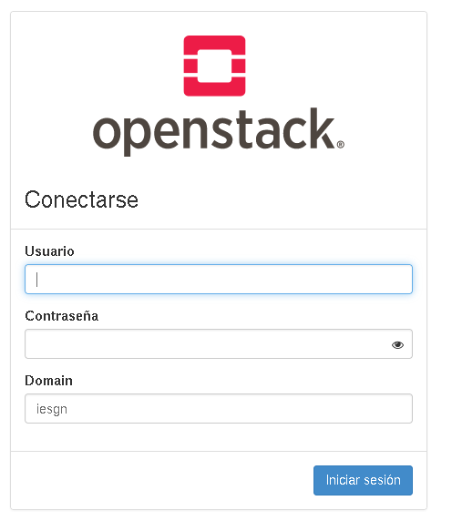
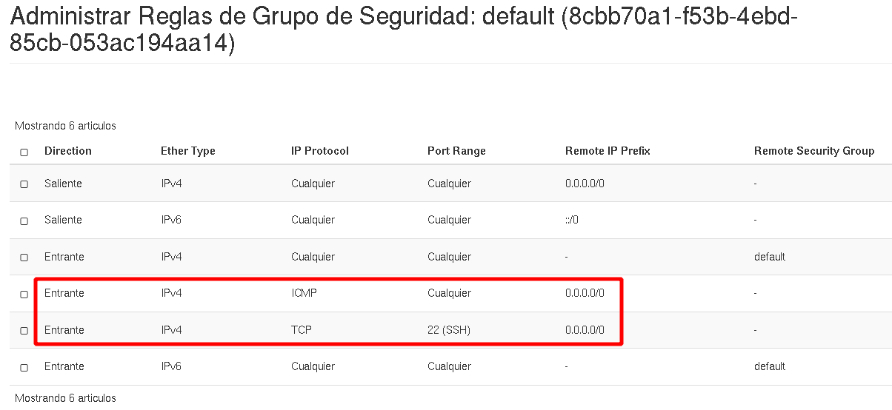

# Acceso a Horizon y primeros pasos

## Acceso a Horizon

Para acceder a la aplicación web horizon entramos en la url `https://openstack.gonzalonazareno.org`:

Donde indicamos nuestro nombre de usuario y contraseña y como dominio elegimos **iesgn**.

## Configuración de las claves ssh

El acceso a las instancias creadas por OpenStack se hará mediante el uso de un par de claves ssh. Por lo tanto, lo primero que tenemos que hacer es subir a OpenStack nuestra clave pública que será inyectada en la instancia en su creación (podemos subir varias y elegiremos la que vamos a inyectar a la hora de crear la instancia).

OpenStack nos da la opción de crear un par de claves con la opción **Crear Par de Claves**, donde ponemos un nombre y escogemos el tipo *Clave SSH*. Esta opción creará un par de claves SSH, la clave pública se guardará en OpenStack y podremos descargar la clave privada para usarla para el acceso de las instancias (evidentemente OpenStack no almacena la clave privada, por lo que sólo tendremos una opción de descargarlas, si la pierdes tendrás que generar nuevas claves).

Si usas normalmente un par de claves propias, la opción más recomendadas es que subas tu clave pública con la opción **Importara clave pública**:

Donde indicas un nombre para identificar la clave, escoges como tipo *Clave SSH* e indicas el fichero de tu clave pública o copias su contenido en el formulario.

## Configuración de los Grupos de seguridad

Los **Grupos de seguridad** nos permiten la configuración de las reglas de cortafuegos que tendrán todas las interfaces de red de nuestras instancias.

Podemos crear distintos conjuntos de reglas de cortafuegos, a cada uno de ellos lo llamamos **Grupo de Seguridad**. Existe un Grupo de Seguridad creado por defecto que se llama **default**. Una instancia puede tener asignados varios Grupos de Seguridad.

La idea de tener las reglas de cortafuegos agrupadas en distintos grupos, nos posibilita agrupar reglas que tengan que ver con un determinado servicio y de esta manera poder ser más flexible a la hora de asignar distintas configuraciones de cortafuegos a distintas instancias. Además como cada interfaz de red de la instancia tiene un cortafuegos nos facilita que cada la configuración de cada uno de ellos sea distinta.

Podemos acceder a los grupos de seguridad en el menú **Red** y **Grupos de Seguridad**. Observamos que tenemos creado un grupo de seguridad por defecto (**Default**). Tenemos la posibilidad de crear nuevos grupos de seguridad eligiendo la opción **Crear grupo de seguridad**:

Si accedemos al Grupo de Seguridad **Default** (opción **Administrar reglas**), vemos las reglas que tenemos creadas y podemos añadir nuevas reglas con la opción **Agregar reglas**: 

Al añadir las reglas poodemos poner los puertos que queremos permitir o elegir de una lista los servicios que queremos permitir. Por ejemplos las reglas que me permiten acceder por SSH y hacer ping a las máquinas desde cualquier origen, quedarían de la siguiente forma:

