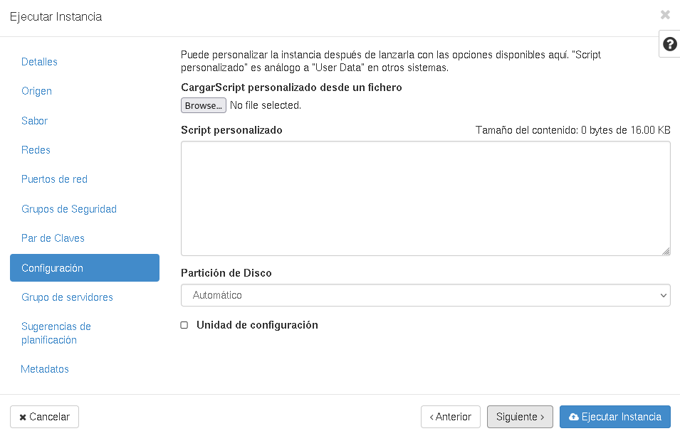

# Configuración de instancias con cloud-init

## Configuración de una instancia

La creación de un servidor en IaaS (instancia) es un proceso peculiar, que requiere un tratamiento específico. Se parte de una imagen mínima, sin contraseña establecida y con una configuración totalmente genérica. Y es necesario realizar una configuración de la máquina:
* Imprescindible la configuración inicial:
	* Generación de la clave ssh de la instancia
	* Parámetros de red, hostname, etc.
	* Autenticación del usuario (clave ssh)
* Configuración no esencial:
	* Actualización de los paquetes instalados, instalación de algún paquete,...
	* Creación de algún usuario
	* ...

## cloud-init

**cloud-init: cloud instance initialization**, es un programa que permite realizar la configuración de la instancia al crearse a partir de una imagen. Es el estándar de facto en nube pública o privada, está desarrollado en python y es un proyecto liderado por Canonical.

El paquete `cloud-init` está instalado habitualmente en las imágenes para IaaS. [Documentación cloud-init](https://cloudinit.readthedocs.io).

Una instancia que se inicia o reinicia, puede obtener diferentes tipos de datos, en función del origen de estos:
* **Metadatos**: Obtenidos del **servidor de metadatos** del proveedor de nube (típicamente a través de dirección de enlace local http://169.254.169.254). Incluye las características propias de la instancia: nombre, configuración de red, tamaño de los discos, etc.
* **Datos de usuario (opcional)**: Datos adicionales de configuración que proporciona el usuario de la instancia (**user-data**).
* **Datos del proveedor (opcional)**: Datos adicionales de configuración proporcionados por el proveedor (**vendor-data**).

Cuando se configura una instancia con cloud-init, se siguen los siguientes pasos:

* Se obtiene la información de la configuración de red. Si no existe, se hace una petición DHCP.
* Se redimensiona la partición raíz.
* Se montan las particiones.
* Se generan los números aleatorios.
* Se establece el hostname.
* Se generan las claves ssh del servidor.
* Otras tareas indicadas por medio del **user-data**.

## user-data: cloud-config

Hay varios formatos aceptados para introducir **user-data**, el más habitual es mediante el formato YAML conocido como cloud-config.

Veamos un ejemplo de un script cloud-config:

```yaml
# cloud-config
# Instalamos algunos paquetes:
packages:
  - apache2
# Configuramos los repositorios del CICA:
apt:
  # Deshabilitamos backports
  disable_suites:
    - backports
  primary:
    - arches: [default]
      uri: https://ftp.cica.es/debian/
  security:
    - arches: [default]
      uri: https://ftp.cica.es/debian-security/
# Configuramos adecuadamente el hostname
preserve_hostname: false
fqdn: test1.gonzalonazareno.org
hostname: test1
# Realizamos un upgrade
package_update: true
package_upgrade: true
# Definimos la zona horaria
timezone: Europe/Madrid
# Crear un usuario y añadir clave pública ssh
users:
  - name: jose
    sudo: ALL=(ALL) NOPASSWD:ALL
    shell: /bin/bash
    passwd: asdasd

    ssh_authorized_keys:
      - ssh-rsa AAAAB3NzaC1yc2EAAAADAQABAAABAQCmjoVIoZCx4QFXvljqozXGqxxlSvO7V2aizqyPgMfGqnyl0J9YXo6zrcWYwyWMnMdRdwYZgHqfiiFCUn2QDm6ZuzC4Lcx0K3ZwO2lgL4XaATykVLneHR1ib6RNroFcClN69cxWsdwQW6dpjpiBDXf8m6/qxVP3EHwUTsP8XaOV7WkcCAqfYAMvpWLISqYme6e+6ZGJUIPkDTxavu5JTagDLwY+py1WB53eoDWsG99gmvyit2O1Eo+jRWN+mgRHIxJTrFtLS6o4iWeshPZ6LvCZ/Pum12Oj4B4bjGSHzrKjHZgTwhVJ/LDq3v71/PP4zaI3gVB9ZalemSxqomgbTlnT
chpasswd:
  list: |
    root:asdasd
    jose:asdasd
  expire: False
```

Puedes acceder a la lista de módulos que puedes usar en cloud-config en la [documentación oficial](https://cloudinit.readthedocs.io/en/latest/topics/modules.html).

## Configuración de cloud-init

En OpenStack Horizon, durante la creación de una instancia podemos indicar el **user-data** en la siguiente pestaña:



Usando la línea de comandos, se indica el fichero de configuración en el parámetro `--user-data`:

	openstack server create --flavor m1.mini \
        --image "Debian 11.0 - Bullseye" \
        --security-group default \
        --key-name clave_jdmr \
        --network "red de josedom" \
        --user-data cloud-config.yaml
        instancia_prueba
