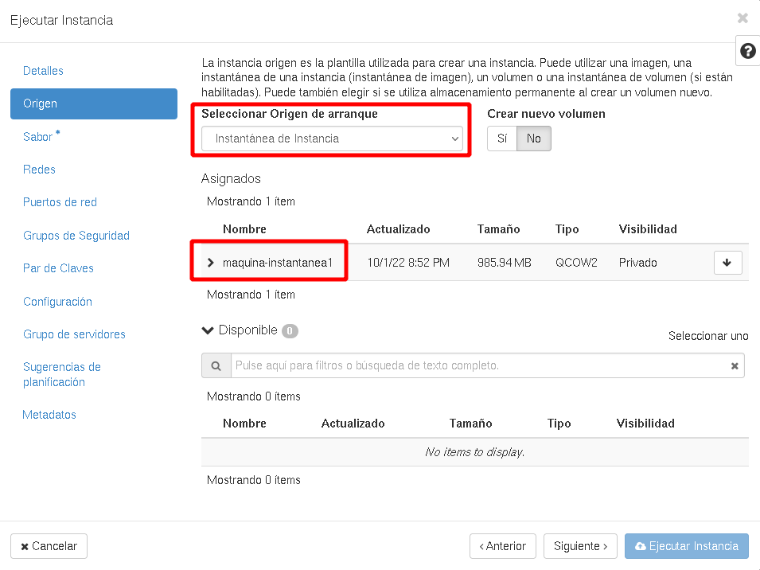

# Instantáneas de instancias

En cualquier momento se puede crear una instantánea de una instancia, con lo que se creará una nueva imagen con el estado actual de la instancia. Es una funcionalidad muy interesante, ya que al almacenarse como una nueva imagen, es posible realizar posteriormente el número de nuevas instancias que se deseen, este proceso es diferente cuando se utilizan volúmenes para almacenar el sistema raíz de una instancia, como se verá en el siguiente tema.

Veamos cómo se hace partiendo de una instancia que se está ejecutando.

Vamos a acceder a la instancia y vamos a realizar un cambio sobre ella, lo mas sencillo es crear un fichero de texto.

```
$ ssh debian@172.22.201.49
$ touch fichero.txt
```
A continuación vamos a realizar una instantánea de la instancia, on lo que se nos creará una nueva imagen desde la que podremos crear nuevas instancias. Creamos la instantánea escogiendo la opción de **Crear instantánea**:


Y podemos observar que en la lista de **Imágenes** encontramos una nueva imagen de tipo *instantanea*:


A continuación podemos crear una nueva instancia a a partir de esta instantánea: 



Y observamos cómo se ha creado la nueva instancia:


Y por último podemos acceder a la nueva instancia (a la que le hemos asignado una nueva IP pública), y comprobar que tiene el fichero que creamos en la instancia anterior: 

```
$ ssh debian@172.22.200.37
$ ls
fichero.txt
```
