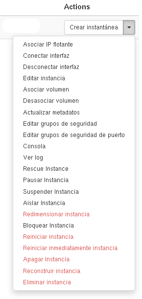

# Operaciones sobre la instancia

Una de las cosas que llama la atención cuando se empieza a utilizar IaaS es que
se hable del ciclo de vida de un servidor, ya que en infraestructura clásica
(tanto de máquinas físicas como virtuales) no existe este concepto, ya que en
infraestructura clásica se espera que un servidor se encienda, se configure y no
se apague salvo en casos excepcionales. La diferencia fundamental con la
infraestructura en nube es que en este caso, se pude tener infraestructura
dinámica compuesta por un número variables de servidores con características
adecuadas para la demanda que haya en cada momento, por eso es importante
controlar de que forma se puede parar, reiniciar o incluso destruir una
instancia.

Las diferentes acciones que se pueden realizar sobre una instancia una vez
creada son las siguientes:

## Acciones sobre la configuración de red de la instancia

* **Asociar IP flotante**: Nos permite asociar a la instancia una de las IPs flotantes que tengamos reservadas.
* **Conectar interfaz**: Nos permite conectar la instancia a una red, añadiendo una nueva interfaz de red.
* **Desconectar interfaz**: Nos permite desconectar la instancia de una red.

## Acciones sobre el almacenamiento de la instancia

* **Asociar volumen**: Nos permite conectar a la instancia algún volumen que tengamos creado. Podremos comprobar que se ha conectado un nuevo disco a la máquina.
* **Desasociar volumen**: Nos permite desconectar de la instancia un volumen.
* **Crear instantánea**: Nos permite crear una nueva imagen a partir del estado de la instancia.

## Acciones sobre la configuración de la seguridad de la instancia

* **Editar Grupos de Seguridad**: Nos permite añadir o quitar grupos de seguridad aplicados a la instancia.
*  **Editar Grupos de Seguridad de puerto**: Nos permite configurar la seguridad de un determinado puerto. Lo utilizaremos, en ocasiones, para desactivar el cortafuego de la máquina en esa interfaz de red desactivando la opción **Seguridad del puerto**.

## Acciones sobre a la información de la instancia

* **Editar instancia**: Nos permite cambiar el nombre de la instancia.
* **Ver log**: Podemos acceder al log de arranque de la instancia. 
* **Consola**: Por último, podemos acceder a una **consola VNC** para manejar nuestra instancia como si se tratase de una máquina virtual, aunque deberá estar definida previamente la contraseña del usuario.
* **Actualizar metadatos**

## Acciones avanzadas sonre la intancia

* **Redimensionar instancia**: Podemos cambiar el sabor de la instancias.
* **Reconstruir instancia / Rescue instance**: Mecanismo que nos posibilita acceder al disco de una instancia que tenga algún problema, con el objetivo se solucionar dicho problema. 
* **Aislar instancia**

## Acciones sobre el ciclo de vida de la instancia

* **Pausar instancia**: Paramos la ejecución de una instancia, guardando su
  estado en memoria RAM.
* **Suspender instancia**: Paramos la ejecución de una instancia, guardando
  su estado en disco.
* **Apagado instancia**: Apagamos la máquina virtual, pero sigue definida,
  por lo que puede volver a arrancarse con las mismas características cuando sea
  necesario.
* **Encender instancia**: Si tenemos una instancia apagada, nos permite
  encenderla.
* **Reanudar instancia**: Si tenemos una instancia suspendida o pausada, nos
  permite indicar que la máquina siga funcionando. 
* **Reiniciar instancia**: Ejecuta un comando *reboot* en la instancia. Tenemos dos tipos: "suave" que intenta hacer un apagado normal de la máquina y su reinicio; también podemos hacer un reinicio "duro", si tenemos algún problema en la instancia.
* **Eliminar instancia**: Destruye la instancia, liberando los recursos que
  tenía ocupados.
