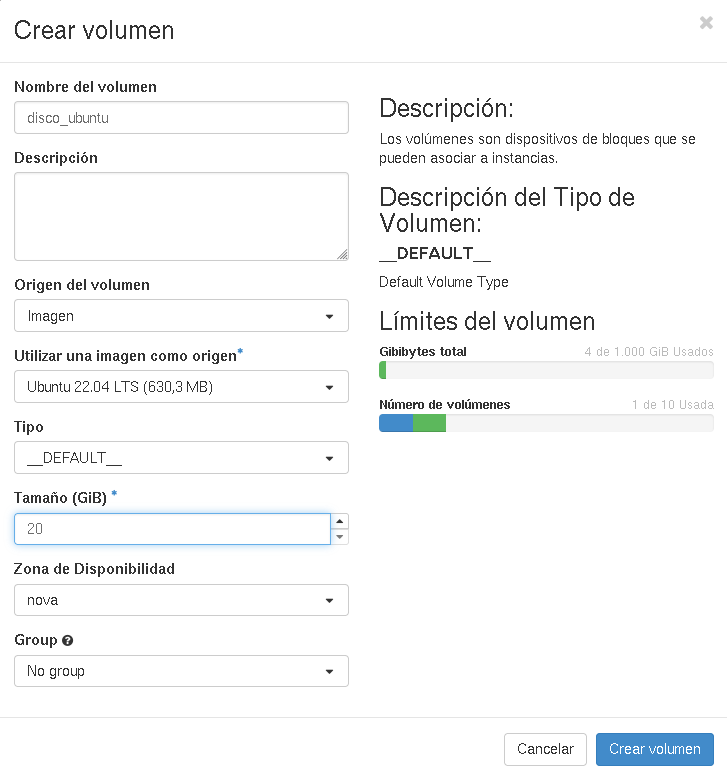
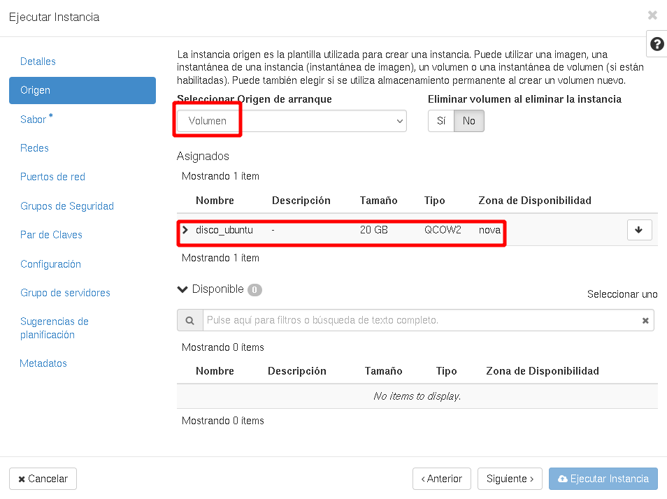
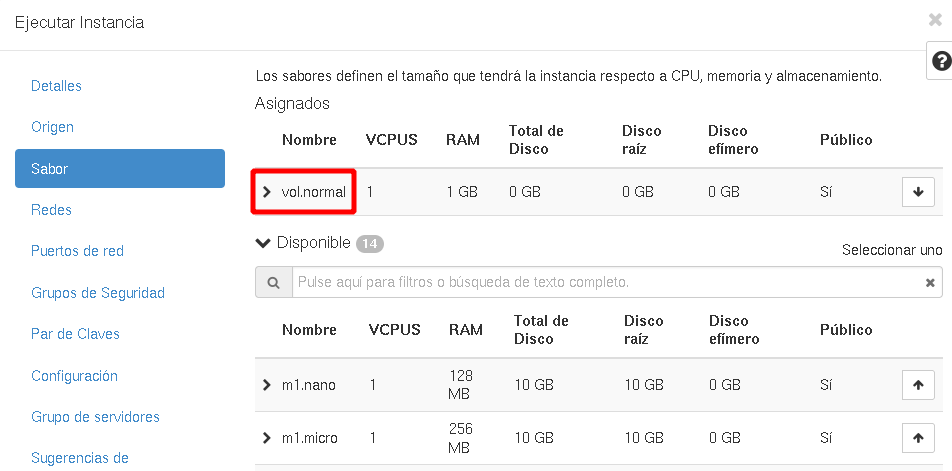

# Creación de instancia ejecutadas sobre volúmenes

Las instancias que hemos creado hasta ahora poseen un disco (*/dev/vda*) efímeros, es decir, su ciclo de vida es exactamente igual al de la instancia, por tanto cuando terminamos la instancia, el disco se destruye.

Tenemos la posibilidad de crear discos a partir de imágenes de sistemas operativos, además estos discos serán arrancables, por lo que las instancias creadas sobre estos discos tendrán una almacenamiento permanente, es decir, aunque terminemos la instancia la información del disco no se perderá, con lo que se podrá crear una nueva instancia usando el disco y mantendrá toda la información y configuración que la instancia anterior.

Veamos los pasos que tenemos que realizar:

1. Creamos un nuevo volumen a partir de una imagen de un sistema operativo.

	

2. Ahora creamos una nueva instancia cuyo origen será el volumen que hemos creado.

	

3. Elegimos un sabor para la nueva instancia del tipo **vol**, ya que no tienen especificado el tamaño del disco raíz porque será el que hemos asignado al volumen.

	

4. Comprobamos que se ha creado la instancia y le hemos asociado una IP flotante:

	

5. Vamos a acceder a la instancia y vamos a realizar un cambio por ejemplo vamos a crear un fichero.

		$ ssh ubuntu@172.22.200.204
		$ touch prueba.txt

6. Terminamos esta instancia (el volumen no se va a destruir) y creamos una nueva instancia a partir del mismo volumen (le vamos a asignar otra IP pública para que apreciemos que estamos accediendo a otra instancia). 

	

	Vamos a comprobar que el fichero creando en la instancia anterior, existe:

		$ ssh ubuntu@172.22.201.52
		$ ls
		prueba.txt
