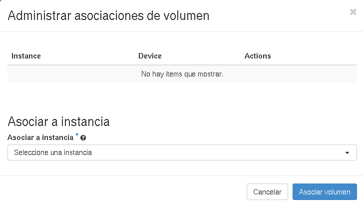

# Creación de volúmenes, asociación a instancias

## Creación de volúmenes

Podemos definir un volumen como un dispositivo de bloques que se puede asociar y desasociar a una instancia cuando se desee. Se puede usar para proporcionar almacenamiento permanente o independiente de la vida de una instancia.

Los pasos para crear un nuevo volumen son los siguientes:

Accedemos al apartado **Volúmenes** y a la opción **Crear Volumen**:

A continuación hay que  introducir la siguiente información:

* Nombre del Volumen: Proporcionamos el nombre que queremos asignar a nuestro volumen.
* Descripción: Parámetro opcional. Una breve descripción acerca del disco.
* Origen del volumen: O elegimos la opción *Sin origen, volumen vacío*, o elegimos la opción * Imagen*, si queremos crear un disco de arranque que contenga la imagen indicada y que puede utilizarse como disco raíz para una instancia posteriormente.
* Tipo: De la lista desplegable indicamos de qué tipo será el volumen a crear. Esta opción depende de que haya más de un tipo definido en el cloud que estemos utilizando o no.
* Tamaño: Indicamos el tamaño en gigabytes que tendrá el nuevo disco.
* Zona de disponibilidad: Zona de la nube donde se desea crear. Sólo existen varias zonas cuando se trata de nubes de infraestructura grandes, en el caso de este curso la única zona disponible se llama *nova*.
* Grupo: Si queremos añadir el volumen a un grupo.

El volumen sólo se podrá eliminar cuando no esté asociado a ninguna instancia.

## Asociar un volumen a una instancia

La operación **Administrar asociaciones**, nos permite gestionar la asociación entre volúmenes e instancias. Si el volumen no está asociado a ninguna instancia podemos escoger la instancia a la que vamos a asociarlo:

Y vemos cómo nos indica la asociación:

Si el volumen ya está asociado a una instancia, podemos desasociarlo con la misma opción:

Si accedemos a la instancia y comprobamos los dispositivos de bloques que tiene conectada, obtendremos lo siguiente:

	$ lsblk
	NAME MAJ:MIN RM   SIZE RO TYPE MOUNTPOINT
	...
	vdb  253:16   0     1G  0 disk 
