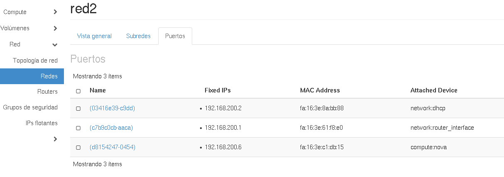
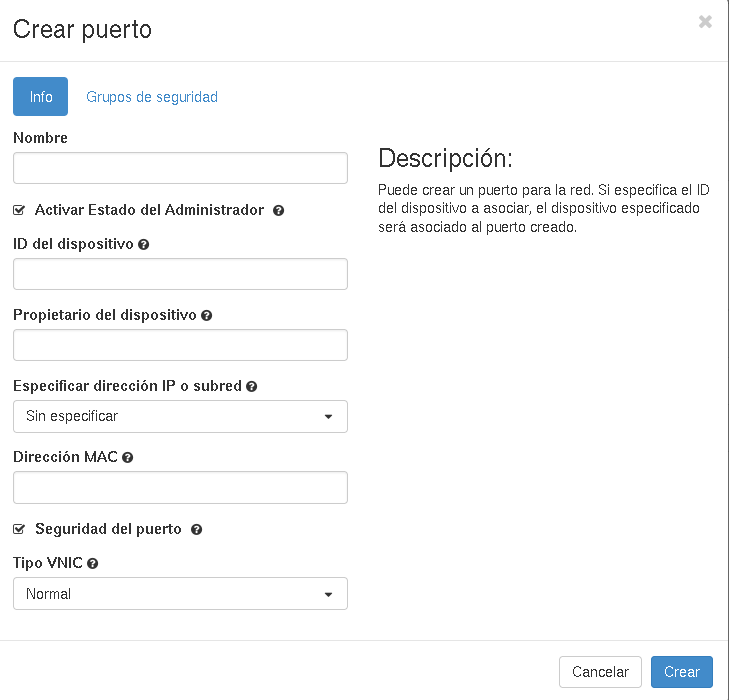
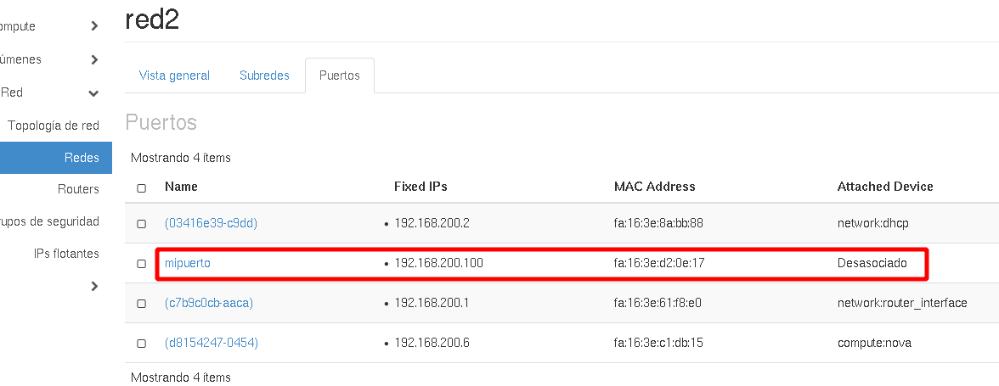
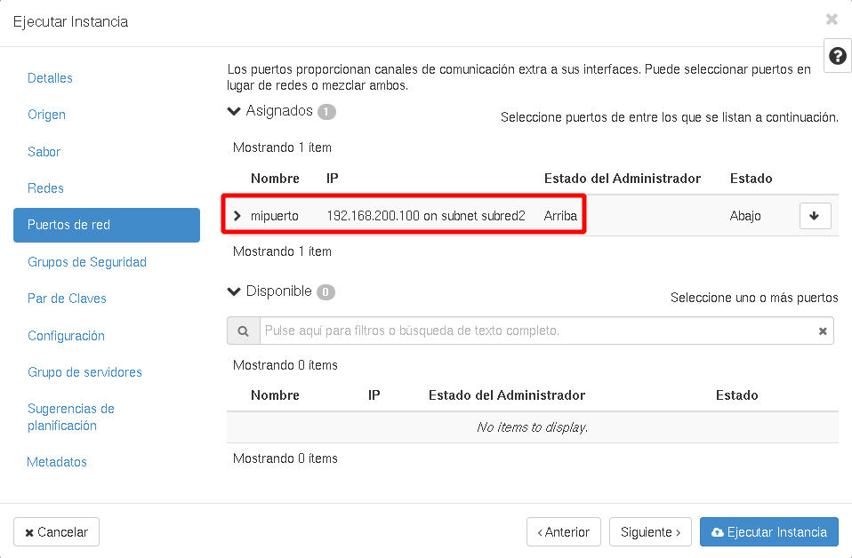
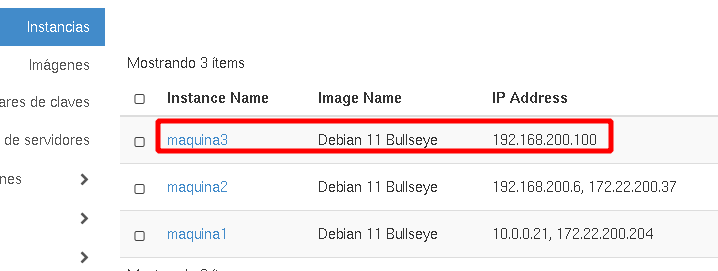

# Puertos de red

Un puerto de red (realmente los puertos están asociados a la subred que hemos definido en la red) lo podemos entender como un puerto virtual de un "switch virtual" que interconecta todos los dispositivos conectados a la red. Para acceder a los puertos de una subred, escogemos la red a la que corresponde y vemos la siguiente pantalla:

Como podemos observar tenemos tres puertos:

* **network:router_interface**: Este puerto corresponde con la interfaz de red conectada al router, y como vimos anteriormente ha tomado la primera dirección del pool de direcciones configurada en el servidor DHCP.
* **compute:nova**: Corresponde al puerto donde se ha conectado la instancia que hemos conectado a la red.
* **network:dhcp**: Corresponde con el puerto donde tenemos conectado el servidor DHCP de la red. Este servidor se crea cuando arrancamos la primera instancia que conectamos a la red, y como puedes observar coge una dirección ip anterior a la que escoge la instancia.

Además podemos ver las conexiones de estos puertos en los distintos dispositivos accediendo al apartado interfaces. Por ejemplo vemos las interfaces del router:

Y las interfaces de la máquina que está conecta a esta red:

## Creación de puertos

Cada vez que conectamos un dispositivo a una red se crea un puerto de red. Otra opción que tenemos es crear un puerto en una subred y configurarlo. Al crearlo, este puerto no estará conectado a ningún dispositivo, pero podremos conectarlo a una instancia o a un router posteriormente.

Elegimos la opción **Crear puerto** en el apartado puertos de una subred:

Los datos más significativos que podemos indicar son:

* Nombre del puerto.
* Especificar la IP, y en este caso lo más interesante sería poner una **IP estática**. Podríamos poner también una IP en un rango de la subred pero se comportaría de manera similar a cuando realiza la conexión directamente a la red.
* Seguridad del puerto: Nos permite habilitar o deshabilitar los grupos de seguridad del puerto, el cortafuego que tiene cada puerto.
* Grupos de seguridad: Nos permite configurar el cortafuegos del puerto.

A continuación, podemos crear una instancia y usar este puerto que hemos creado para su conexión (la estaríamos conectando a la red donde hemos creado el puerto):

Y finalmente comprobamos que se ha creado la instancia con la IP que habíamos configurado en el puerto.

